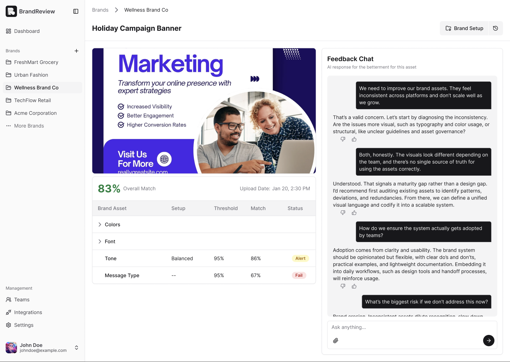
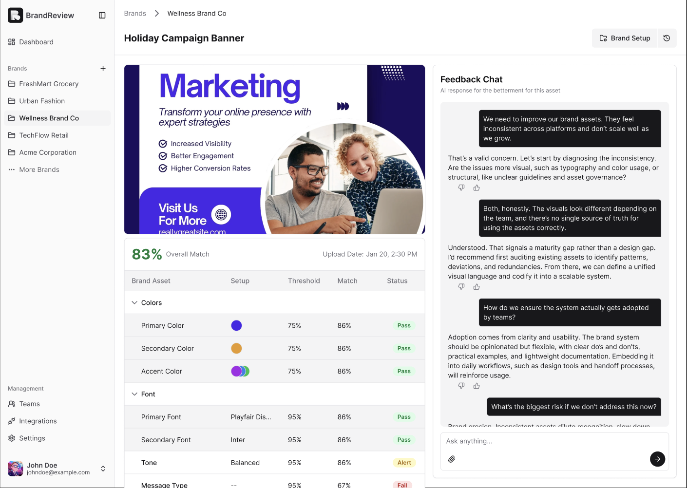
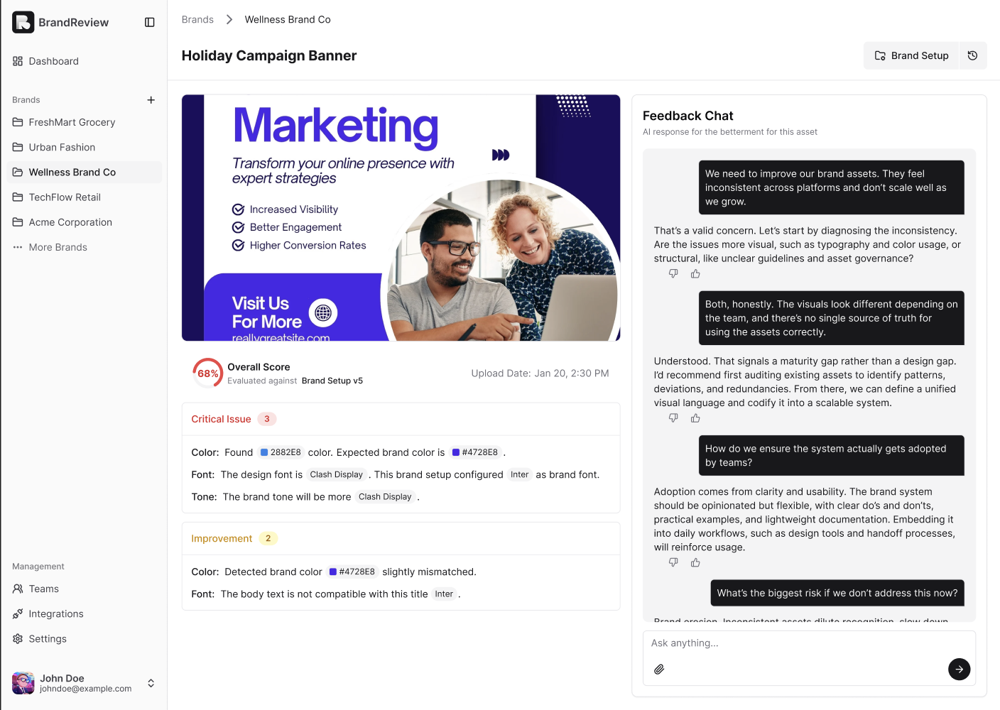

<p align="center">
  
</p>

<h1 align="center">BrandReviewAI</h1>

<p align="center">
  Automated brand-compliance analysis for marketing assets — color, typography, copywriting tone, and logo placement, in one pipeline.
</p>

---

## What it is

BrandReviewAI helps brand teams review creative assets against their brand guidelines automatically. Upload a marketing asset, and four independent AI analyzers grade it across the dimensions that matter most to brand consistency — turning a manual review checklist into a structured, repeatable report.

<p align="center">
  
</p>

## The four analyzers

- **🎨 Color Palette** — extracts dominant colors from any image and validates them against your brand palette using perceptually-accurate color science (CIEDE2000 + WCAG contrast).
- **🔤 Typography** — identifies the fonts used in an image via OCR plus a HuggingFace font-identifier model, and checks them against your approved typography.
- **✍️ Copywriting Tone** — analyzes formality, warmth, energy, sentiment, and brand voice using Qwen2.5-VL.
- **🏷️ Logo Detection** — hybrid pipeline: YOLOv8-nano on the fast path (~50ms), with a Qwen2.5-VL fallback for ambiguous cases.

<p align="center">
  
</p>

## Architecture

```
   ┌──────────┐      ┌──────────┐      ┌─────────────────────────┐
   │  br-fe   │ ───▶ │  br-be   │ ───▶ │  context-fusion-engine  │
   │ React 19 │      │ Fastify  │      │  Flask + 4 analyzers    │
   └──────────┘      └────┬─────┘      └────────────┬────────────┘
                          │                         │
                     MongoDB · S3              vLLM (Qwen2.5-VL)
```

A user uploads an asset in the React frontend. `br-be` stores the file in S3 and writes its metadata to MongoDB, then calls the Python `context-fusion-engine`, which runs the four analyzers in parallel and returns a structured compliance report.

<p align="center">
  
</p>

## Repository layout

| Module | Description |
|---|---|
| [`br-fe`](../br-fe/) | React 19 + Vite frontend |
| [`br-be`](../br-be/) | Fastify + MongoDB API |
| [`context-fusion-engine`](../consolidated_pipeline/) | Python Flask backend orchestrating the four analyzers |

**Analyzer modules:**

- [`ColorExtraction-with-Kmeans-ColorSpaceProcessing-CIEDE2000DistanceColorMatching`](../ColorPaletteChecker/) — standalone color analyzer
- [`FontIdentification-PaddleOCR-gaborcselle_font_identifier`](../FontTypographyChecker/) — standalone typography analyzer
- [`BrandVoiceChecker-PaddleOCR-vLLM-Qwen2.5_3B`](../CopywritingToneChecker/) — standalone brand-voice / copywriting-tone module
- [`LogoDetectionModels-With-BrandPlacementRulesEngine-and-ValidationPipeline`](../LogoDetector/) — standalone logo-detection module

---

<sub>For service-level setup, env vars, and commands, see each subproject's own README.</sub>
